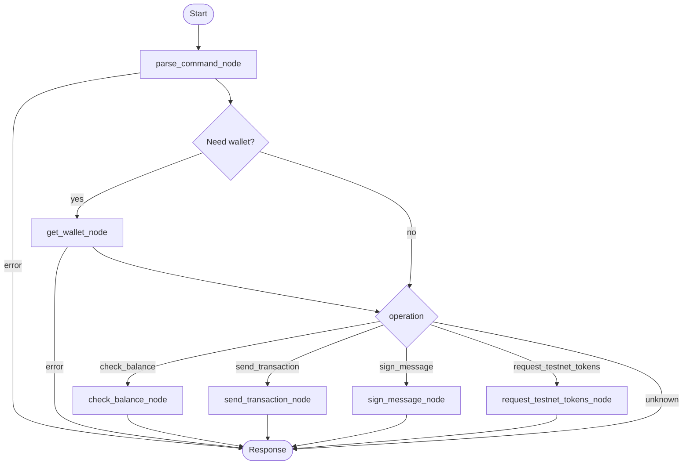

# Sendly AI Agent

Sendly AI Agent is the backend for a Telegram bot that helps users manage crypto wallets via Circle Developer-Controlled Wallets. The agent understands natural language, supports voice commands, stores contacts in Supabase, and executes wallet operations through a lightweight state-driven flow that does not depend directly on the LangGraph runtime.

## Key Features

- Natural language command parsing powered by configurable LLM providers (AIMLAPI or OpenAI) with automatic fallback.
- Telegram interface that supports both text and voice messages, including ElevenLabs transcription.
- Wallet operations via the Circle SDK: balance lookup, transaction creation, message signing, and testnet faucet requests.
- Supabase integration for secure storage of user contacts and scheduled jobs.
- Periodic polling of Supabase schedules with protection against duplicate triggers.
- Extensible node-based execution pipeline (`AgentGraph`) that selects the next action based on user state.

## Project Structure

```
ai-agents/
├── README.md
└── backend/
    ├── main.py              # Telegram bot entry point
    ├── agent/
    │   ├── graph.py         # Agent graph definition
    │   ├── nodes.py         # Command parsing and execution nodes
    │   ├── state.py         # Agent state schema
    │   └── tools.py         # Circle and Supabase integrations
    ├── services/
    │   ├── circle_service.py    # Circle SDK wrapper
    │   ├── elevenlabs_service.py# Voice transcription service
    │   └── supabase_service.py  # Contacts and schedule management
    ├── config/settings.py   # Environment variable loading and validation
    └── tests/               # Pytest coverage for services
```

## LangGraph Flow



## Runtime Overview

- `main.py` configures the Telegram bot, registers commands (`/start`, `/help`, `/voice_help`, `/addcontact`, `/listcontacts`, `/deletecontact`), and schedules periodic jobs.
- `invoke_agent` builds the initial state (user profile, contacts, defaults) and passes it to the `AgentGraph`.
- `parse_command_node` uses the LLM to determine user intent, extract parameters (recipient, amount, token), and resolve contacts stored in Supabase.
- Depending on the intent, the graph executes the corresponding node:
  - `check_balance_node` — retrieves balances via Circle.
  - `send_transaction_node` — submits a transfer and tracks the transaction hash.
  - `sign_message_node` — signs arbitrary messages.
  - `request_testnet_tokens_node` — requests faucet distributions on supported testnets.
- `SupabaseService` manages contacts, wallets, and scheduled jobs. The periodic `schedule_polling_job` monitors the `scheduled_jobs` table and triggers Supabase edge functions.
- `ElevenLabsService` transcribes voice messages into text, which then flows through the same pipeline as text commands.

## Useful Links

- [Circle Developer-Controlled Wallets SDK](https://developers.circle.com/wallets/docs/sdk-overview)
- [LangGraph Concepts](https://langchain-ai.github.io/langgraph/)
- [python-telegram-bot Documentation](https://docs.python-telegram-bot.org/en/stable/)
- [Supabase Documentation](https://supabase.com/docs)

